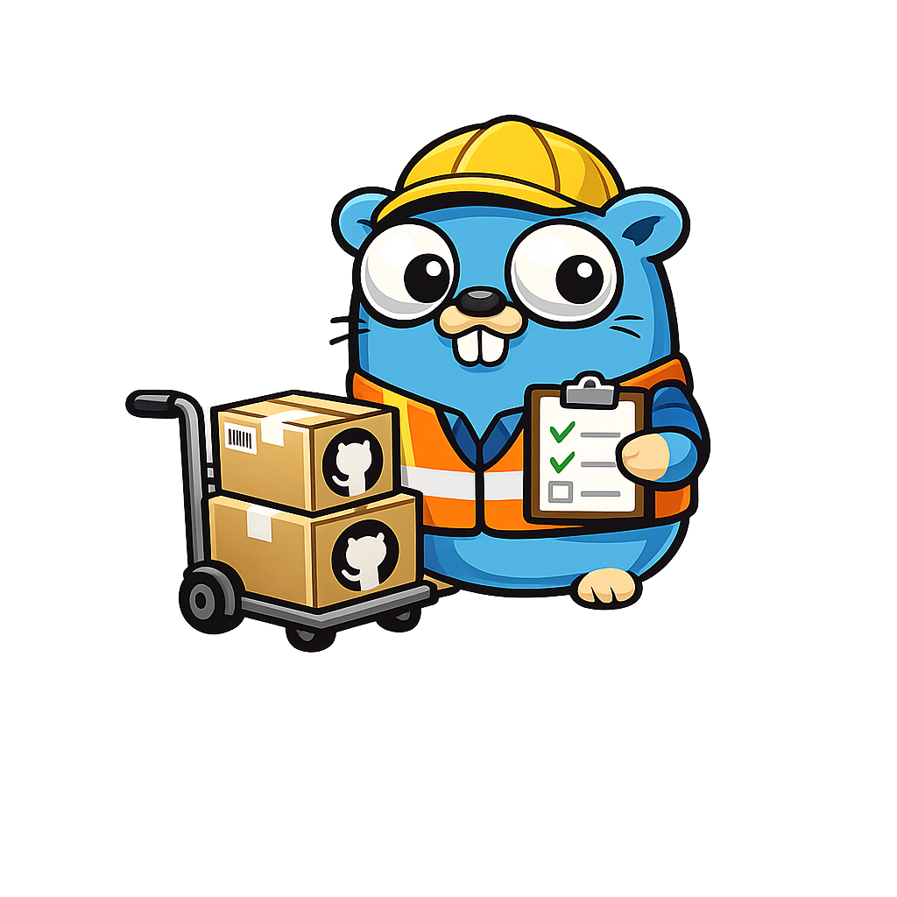

# go-sort-out-gh-actions


[](https://goreportcard.com/report/github/toozej/go-sort-out-gh-actions)




A tool to detect archived GitHub Actions in repository workflows.

## What it does

This tool scans your GitHub Actions workflows (`.github/workflows/**/*.yml` and `**/*.yaml`) and checks if any of the `uses:` actions have been archived by their maintainers on GitHub. Archived actions may contain security vulnerabilities, stop receiving updates, or cease working with future GitHub changes.

## Features

- 🔍 **Automatic Detection**: Scans all workflow files in your repository
- 🚨 **Exit Codes**: Returns error code when archived actions are found (CI/CD friendly)
- ⚠️ **Outdated Detection**: Optionally checks for outdated action versions
- ⏳ **Stale Detection**: Detects actions not updated in over a year or marked with GitHub deprecation warnings
- 📢 **Notifications**: Send alerts to configured webhooks when archived actions are detected
- 🐛 **Issue Creation**: Automatically create GitHub issues to track replacement tasks
- 🔧 **Flexible Configuration**: Environment variables, config files, and CLI flags
- 📊 **Verbose Output**: Detailed reporting of findings and API calls
- 🐳 **Docker Support**: Run via Docker or as native binary
- ⚡ **Concurrent API Calls**: Parallel repository checks with rate limit protection
- 💾 **Smart Caching**: Each action is looked up only once, even if used across multiple workflows

## Installation

### From GitHub Releases

Download the latest release from [GitHub Releases](https://github.com/toozej/go-sort-out-gh-actions/releases).

### Using Go

```bash
go install github.com/toozej/go-sort-out-gh-actions@latest
```

### Docker

```bash
# Mount your current working directory so the tool can scan your workflows
docker run --rm -v $(pwd):/workspace -w /workspace ghcr.io/toozej/go-sort-out-gh-actions:latest

# With a GitHub token
docker run --rm -v $(pwd):/workspace -w /workspace -e GH_TOKEN=your_token ghcr.io/toozej/go-sort-out-gh-actions:latest

# With verbose output and outdated checking
docker run --rm -v $(pwd):/workspace -w /workspace -e GH_TOKEN=your_token ghcr.io/toozej/go-sort-out-gh-actions:latest outdated --verbose
```

## Usage

### Sub-commands

The tool provides several sub-commands for different check types:

```bash
# Check for archived actions
go-sort-out-gh-actions archived

# Check for outdated actions (not archived, but not latest version)
go-sort-out-gh-actions outdated

# Check for EOL/stale/deprecated actions
go-sort-out-gh-actions eol

# Run all checks (archived + EOL + outdated)
go-sort-out-gh-actions check
```

### Basic Usage

```bash
# Check all workflows in current repository for archived actions
go-sort-out-gh-actions archived

# Check a specific workflow file
go-sort-out-gh-actions archived --workflow .github/workflows/ci.yml

# Check a specific directory of workflow files
go-sort-out-gh-actions archived --workflows-dir ~/src/github/username/repo/.github/workflows

# Check multiple repos in a base directory (bulk scanning)
go-sort-out-gh-actions archived --repos-dir ~/src/github

# Verbose output
go-sort-out-gh-actions archived --verbose

# Debug logging (includes rate limit info)
go-sort-out-gh-actions archived --debug

# Check for outdated actions with auto-update (pin to SHA)
go-sort-out-gh-actions outdated --update --pin

# Check for outdated actions with semver version strings
go-sort-out-gh-actions outdated --update --semver

# Check for EOL/stale/deprecated actions
go-sort-out-gh-actions eol

# Check for EOL actions with custom stale threshold (180 days instead of default 365)
go-sort-out-gh-actions eol --stale-days 180

# Run all checks and auto-update EOL + outdated actions
go-sort-out-gh-actions check --write
```

### Path Expansion

All path inputs support `~` expansion to your home directory:

```bash
go-sort-out-gh-actions --workflows-dir ~/src/github/repo/.github/workflows
go-sort-out-gh-actions --repos-dir ~/src/github
```

### Authentication

Set your GitHub token using one of these methods (in order of priority):

1. `--token` flag
2. `GH_TOKEN` environment variable
3. `GITHUB_TOKEN` environment variable

```bash
# Using environment variable
export GH_TOKEN=your_github_token_here
go-sort-out-gh-actions

# Using CLI flag
go-sort-out-gh-actions --token your_github_token_here

# Using GitHub CLI (gh) to get a token automatically
export GH_TOKEN=$(gh auth token)
go-sort-out-gh-actions

# Or inline
go-sort-out-gh-actions --token $(gh auth token)
```

### Notifications

Configure one or more notification providers and enable them with the `--notify` flag:

```bash
# Example: Configuring Slack
export SLACK_TOKEN=xoxb-...
export SLACK_CHANNEL_ID=C12345678
go-sort-out-gh-actions --notify
```

### Issue Creation

Automatically create GitHub issues when archived actions are found:

```bash
go-sort-out-gh-actions --create-issue
```

### Configuration File

Create a `.env` file in your repository root:

```env
GH_TOKEN=your_github_token_here
SLACK_TOKEN=xoxb-...
SLACK_CHANNEL_ID=C12345678
CREATE_ISSUES=true
```

### GitHub Actions

This repository provides multiple composite actions (similar to [actions/cache](https://github.com/actions/cache)):

| Action | Description |
|--------|-------------|
| `toozej/go-sort-out-gh-actions@main` | Check for archived actions (default/root action) |
| `toozej/go-sort-out-gh-actions/check-archived@main` | Check for archived actions with notifications and issue creation |
| `toozej/go-sort-out-gh-actions/check-outdated@main` | Check for outdated action versions with optional auto-update |
| `toozej/go-sort-out-gh-actions/eol@main` | Check for EOL/stale/deprecated actions |
| `toozej/go-sort-out-gh-actions/check@main` | Run all checks (archived + EOL + outdated) |

#### Check Archived Actions

```yaml
name: Check for Archived Actions
on:
  schedule:
  - cron: '0 0 * * 0' # Weekly
  workflow_dispatch:

jobs:
  check:
    runs-on: ubuntu-latest
    steps:
    - name: Checkout
      uses: actions/checkout@v4

    - name: Check archived actions
      id: check
      uses: toozej/go-sort-out-gh-actions@main
      with:
        token: ${{ secrets.GITHUB_TOKEN }}
        verbose: true
        create-issue: true

    - name: Fail if archived actions found
      if: steps.check.outputs.has-archived == 'true'
      run: exit 1
```

#### Check Archived Actions with Notifications

```yaml
name: Check Archived Actions and Notify
on:
  schedule:
  - cron: '0 0 * * 0' # Weekly
  workflow_dispatch:

jobs:
  check:
    runs-on: ubuntu-latest
    steps:
    - name: Checkout
      uses: actions/checkout@v4

    - name: Check archived actions
      id: check
      uses: toozej/go-sort-out-gh-actions/check-archived@main
      with:
        token: ${{ secrets.GITHUB_TOKEN }}
        verbose: true
        notify: true
        create-issue: true

    - name: Fail if archived actions found
      if: steps.check.outputs.has-archived == 'true'
      run: exit 1
```

#### Check Outdated Actions

```yaml
name: Check for Outdated Actions
on:
  schedule:
  - cron: '0 0 * * 0' # Weekly
  workflow_dispatch:

jobs:
  check:
    runs-on: ubuntu-latest
    steps:
    - name: Checkout
      uses: actions/checkout@v4

    - name: Check outdated actions
      id: check
      uses: toozej/go-sort-out-gh-actions/check-outdated@main
      with:
        token: ${{ secrets.GITHUB_TOKEN }}
        verbose: true

    - name: Fail if outdated actions found
      if: steps.check.outputs.has-outdated == 'true'
      run: exit 1
```

#### Auto-Update Outdated Actions (Pin to SHA)

```yaml
name: Auto-Update Outdated Actions
on:
  schedule:
  - cron: '0 0 * * 0' # Weekly
  workflow_dispatch:

jobs:
  update:
    runs-on: ubuntu-latest
    permissions:
      contents: write
    steps:
    - name: Checkout
      uses: actions/checkout@v4
      with:
        token: ${{ secrets.GITHUB_TOKEN }}

    - name: Update outdated actions
      id: update
      uses: toozej/go-sort-out-gh-actions/check-outdated@main
      with:
        token: ${{ secrets.GITHUB_TOKEN }}
        verbose: true
        update: true
        pin: true

    - name: Commit updated workflows
      run: |
        git config user.name "github-actions[bot]"
        git config user.email "github-actions[bot]@users.noreply.github.com"
        git add ".github/workflows/**.yml" ".github/workflows/**.yaml"
        git diff --cached --quiet || git commit -m "chore(deps): pin outdated GitHub Actions to SHA references"
        git push
```

#### Run All Checks

```yaml
name: Check All GitHub Actions
on:
  schedule:
  - cron: '0 0 * * 0' # Weekly
  workflow_dispatch:

jobs:
  check:
    runs-on: ubuntu-latest
    steps:
    - name: Checkout
      uses: actions/checkout@v4

    - name: Run all checks
      id: check
      uses: toozej/go-sort-out-gh-actions/check@main
      with:
        token: ${{ secrets.GITHUB_TOKEN }}
        verbose: true
        notify: true
        create-issue: true

    - name: Fail if issues found
      if: steps.check.outputs.has-archived == 'true' || steps.check.outputs.has-outdated == 'true' || steps.check.outputs.has-eol == 'true'
      run: exit 1
```

### Pre-commit Hook

Add to your `.pre-commit-config.yaml`:

```yaml
repos:
- repo: https://github.com/toozej/go-sort-out-gh-actions
  rev: main
  hooks:
  - id: go-sort-out-gh-actions
    name: Check for archived GitHub Actions
    args: [--verbose]
```

## Exit Codes

- `0`: Success - no archived, outdated, or stale actions found
- `1`: Error - archived, outdated, or stale actions found, or execution failed

## Example Output

### Archived Actions Only

```
$ go-sort-out-gh-actions archived --verbose

Found 3 workflow files
- .github/workflows/ci.yml (2 uses)
- .github/workflows/release.yml (1 uses)
Extracted 3 unique action references
- actions/checkout
- actions/setup-go
- docker/build-push-action

Checking 3 action repositories for archived status...

🚨 Found 1 archived GitHub Actions in 1 workflows:

📄 .github/workflows/ci.yml:
❌ actions/checkout

❌ Archived actions detected. Please replace them with actively maintained alternatives.
```

### With Outdated Checking

```
$ go-sort-out-gh-actions check --verbose

Found 1 workflow files
- example/workflows/example-archived-actions.yaml (9 uses)
Extracted 9 unique action references
- actions-rs/toolchain@v1
- actions/cache@v2
- actions/checkout@v4
Checking 9 action repositories for archived status...
Checking 5 non-archived action repositories for latest versions...

🚨 Found 4 archived GitHub Actions in 4 workflows:

📄 example-archived-actions.yaml:
❌ actions-rs/audit-check@v1
❌ actions-rs/cargo@v1
❌ actions-rs/clippy-check@v1
❌ actions-rs/toolchain@v1


⚠️ Found 2 outdated GitHub Actions in 2 uses:

📄 example-archived-actions.yaml:
⚠️ actions/cache@v2 (latest: v4.0.0)
⚠️ actions/checkout@v4 (latest: v4.1.0)

❌ Archived actions detected. Please replace them with actively maintained alternatives.
```

### With Stale Checking

```
$ go-sort-out-gh-actions eol --verbose

Checking 5 non-archived action repositories for stale/deprecated status...

⏳ Found 1 stale/deprecated GitHub Actions in 1 uses:

📄 ci.yml:
⏳ some-action/old-action@v1 (DEPRECATED: This action uses Node.js 16 which is deprecated)
⏳ another/stale-action@v2 (not updated since 2021-05-10)

⏳ Stale or deprecated actions detected. Consider replacing them with actively maintained alternatives.
```

### Major Version Tag Handling

When using the `outdated` sub-command, the tool intelligently handles major version tags (e.g., `v2`):

- If you're using `action@v2` and the latest release is `v2.3.3`, the tool compares the commit SHAs
- If the major version tag (`v2`) points to the same commit as the latest version (`v2.3.3`), it's **not** marked as outdated
- If the major version tag (`v2`) points to a different commit than `v2.3.3`, it **is** marked as outdated (a new patch exists)
- This allows you to use major version tags (recommended practice) without false positives

```
# action@v2 points to same commit as v2.3.3 (same SHA) - NOT outdated
# action@v2 but latest is v3.0.0 (different major) - IS outdated
```

### Debug Mode (Rate Limit Info)

When running with `--debug`, the tool logs GitHub API rate limit information:

```
$ go-sort-out-gh-actions archived --debug
DEBU[0000] GitHub API rate limit: limit=5000 remaining=4998 used=2 reset=2026-05-04T22:00:00Z resource=core
```

## Configuration

### Core Settings

| Environment Variable | CLI Flag | Sub-command(s) | Description |
|---------------------|----------|----------------|-------------|
| `GH_TOKEN` | `--token`, `-t` | all | GitHub API token (preferred) |
| `GITHUB_TOKEN` | `--token`, `-t` | all | GitHub API token (fallback) |
| `CREATE_ISSUES` | `--create-issue` | archived, check | Create GitHub issues (true/false) |
| `NOTIFY_CONDENSE` | - | all (with `--notify`) | Condense multiple notifications into one (true/false) |
| - | `--notify` | archived, eol, check | Enable notifications to configured endpoints |
| - | `--workflow` | all | Path to specific workflow file to check |
| - | `--workflows-dir` | all | Path to directory containing workflow yaml files |
| - | `--repos-dir` | all | Path to base directory containing multiple repos to scan |
| - | `--update` | outdated, eol | Write updated versions to affected workflow files |
| - | `--pin` | outdated | Pin actions to SHAs instead of semver version strings |
| - | `--semver` | outdated | Use semver version strings instead of SHAs when updating |
| - | `--write`, `-w` | check | Auto-apply updates for EOL and outdated actions |
| - | `--stale-days` | archived, eol, check | Days before an action is considered stale (default 365) |
| - | `--verbose`, `-v` | all | Show detailed output |
| - | `--debug`, `-d` | all | Enable debug-level logging (includes rate limit info) |

### Notification Providers

Configure one or more of the following providers to receive alerts when archived actions are found. Use the `--notify` flag to enable notifications.

| Provider | Environment Variables |
|----------|-----------------------|
| **Gotify** | `GOTIFY_ENDPOINT`, `GOTIFY_TOKEN` |
| **Slack** | `SLACK_TOKEN`, `SLACK_CHANNEL_ID` |
| **Telegram** | `TELEGRAM_TOKEN`, `TELEGRAM_CHAT_ID` |
| **Discord** | `DISCORD_TOKEN`, `DISCORD_CHANNEL_ID` |
| **Pushover** | `PUSHOVER_TOKEN`, `PUSHOVER_RECIPIENT_ID` |
| **Pushbullet** | `PUSHBULLET_TOKEN`, `PUSHBULLET_DEVICE_NICKNAME` |

## Quick Demo

To quickly see how this tool works, run the demo which checks an example workflow containing archived and outdated actions:

```bash
# Build and run against example workflow (includes outdated checking)
make demo

# Or run manually after building
make local-build
./out/go-sort-out-gh-actions outdated --workflow example/workflows/example-archived-actions.yaml --verbose

# Run archived check
./out/go-sort-out-gh-actions archived --workflow example/workflows/example-archived-actions.yaml --verbose

# Run all checks
./out/go-sort-out-gh-actions check --workflow example/workflows/example-archived-actions.yaml --verbose

# Using GitHub CLI for authentication
./out/go-sort-out-gh-actions outdated --workflow example/workflows/example-archived-actions.yaml --verbose --token $(gh auth token)
```

The example workflow at `example/workflows/example-archived-actions.yaml` contains:
- **Archived actions** (4 from `actions-rs/*` organization): `actions-rs/toolchain`, `actions-rs/cargo`, `actions-rs/clippy-check`, `actions-rs/audit-check`
- **Current actions** (GitHub official): `actions/checkout@v6`, `actions/setup-go@v6`, `github/codeql-action`, `actions/upload-artifact@v4`, `actions/download-artifact@v4`
- **Outdated but not archived**: `actions/cache@v2` (latest: v5.x), `actions/download-artifact@v4` (latest: v8.x), `actions/upload-artifact@v4` (latest: v7.x)
