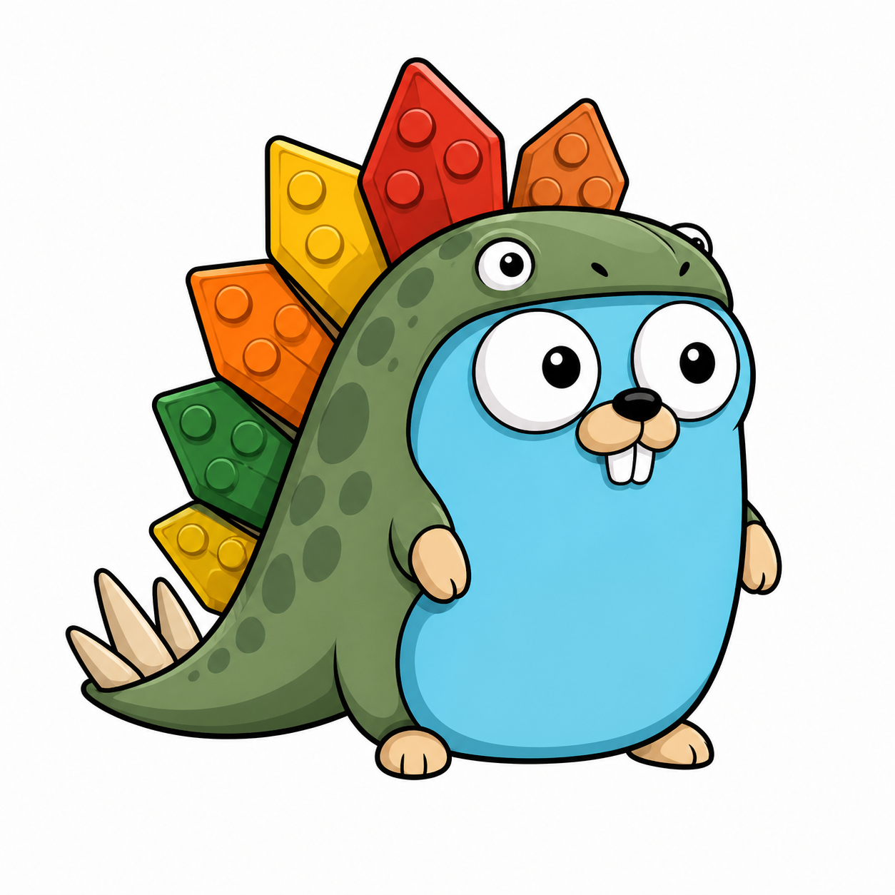

# lego-stego


[](https://goreportcard.com/report/github.com/toozej/lego-stego)


Go-based CLI tool for [Steganography](https://en.wikipedia.org/wiki/Steganography)



## Features

- QR code steganography
- Arbitrary file embedding
- AES-GCM encryption (Argon2id KDF)
- Reed–Solomon error correction
- Adaptive noise-aware embedding
- Randomized embedding (password-derived)
- PNG support (lossless)
- Automatic QR decoding

## Usage

### Embed QR
```
lego-stego embed -i carrier.png -o out.png -u https://example.com --password secret
```

### Extract QR
```
lego-stego extract -i out.png -o qr.png --password secret
```

### Hide File
```
lego-stego hide -i carrier.png -f secret.bin -o out.png --password secret
```

### Reveal File
```
lego-stego reveal -i out.png -o secret.bin --password secret
```

## Security Notes
Always use a strong password
PNG only (lossless required)
Resistant to casual inspection, not nation-state steganalysis

## changes required to use this as a starter template
- set up new repository in quay.io web console
    - (DockerHub and GitHub Container Registry do this automatically on first push/publish)
    - name must match Git repo name
    - grant robot user with username stored in QUAY_USERNAME "write" permissions (your quay.io account should already have admin permissions)
- set built packages visibility in GitHub packages to public
    - navigate to https://github.com/users/$USERNAME/packages/container/$REPO/settings
    - scroll down to "Danger Zone"
    - change visibility to public

