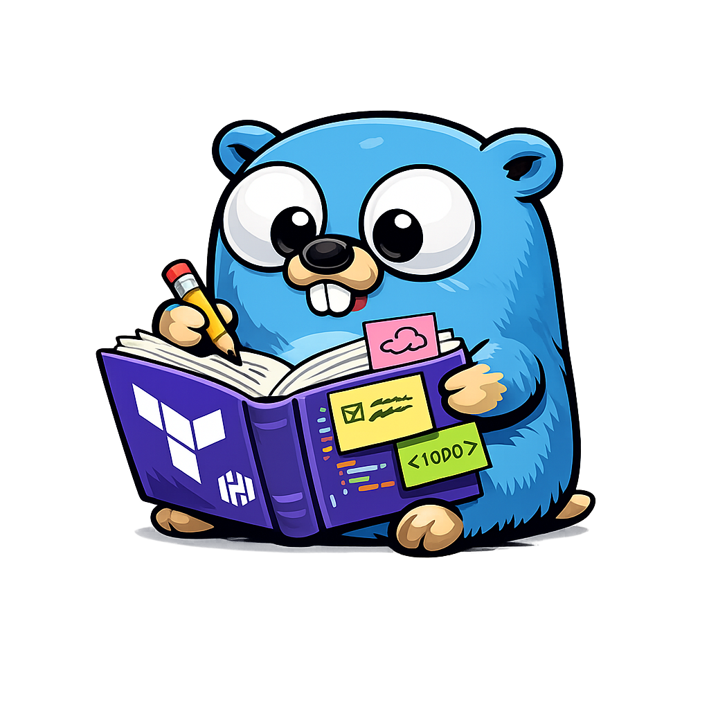

# Terranotate - Terraform Comment Parser and Validator




**Terranotate** is a powerful Go-based tool for parsing, validating, and auto-fixing structured comments in Terraform code. It helps teams enforce documentation standards, compliance requirements, and metadata consistency across their infrastructure as code.

## Features

- 🔍 **Parse** - Extract and analyze structured comments from Terraform files
- ✅ **Validate** - Enforce comment schemas with required fields and type checking
- 🔧 **Auto-Fix** - Automatically add missing comment blocks with intelligent defaults
- 📦 **Module Support** - Validate entire modules including sub-modules
- 🏢 **Workspace Support** - Recursive validation of entire Terraform workspaces
- 📊 **Rich Reporting** - Clear, actionable error messages with line numbers
- 🎯 **Flexible Schemas** - YAML-based schema definitions for easy customization

## Quick Start

```bash
# Clone the monorepo
git clone https://github.com/toozej/monogo.git
cd monogo

# Build the binary
task local:build APP=terranotate
# (Or use the installed binary if you have it)

# Verify installation
./out/terranotate help
```

## Commands

### 1. Parse - Extract and Display Comments

```bash
# Parse and display all comments from a single file
./out/terranotate parse examples/example.tf
```

### 2. Validate - Smart Validation

```bash
# Validate a single file, module, or entire workspace against schema
# The tool auto-detects the structure and applies appropriate validation
./out/terranotate validate examples/example.tf examples/schema.yaml
./out/terranotate validate ./examples/example1-aws-module/vpc examples/schema.yaml
./out/terranotate validate ./examples/example2-aws-workspace examples/schema.yaml
```

### 3. Fix - Auto-Fix Validation Issues

```bash
# Automatically fix validation issues by adding missing comments
./out/terranotate fix examples/example.tf examples/schema.yaml

# Revert changes using backup files (.bak)
./out/terranotate fix --revert examples/example.tf
```

### 4. Generate - Markdown Documentation

```bash
# Generate markdown documentation from Terraform resources and annotations
./out/terranotate generate ./examples/example1-aws-module/vpc examples/schema.yaml

# Generate and save to a file
./out/terranotate generate ./infrastructure schema.yaml --output dynamic-inventory.md
```

## Documentation

- [API Usage](docs/api-usage.md)
- [Advanced Usage & Customization](docs/advanced-usage.md)
- [Troubleshooting](docs/troubleshooting.md)

## Development

This project uses a standard Go project layout.

### Prerequisites
- Go

### Build
```bash
task local:build
```

### Test
```bash
task test
```

### Lint/Pre-commit
```bash
task pre-commit
```

## Use Cases

### 1. CI/CD Pipeline
```bash
# Validate before applying
./out/terranotate validate ./infrastructure schema.yaml
if [ $? -eq 0 ]; then
    terraform plan
fi
```

### 2. Documentation Generation
```bash
# Automatically update infrastructure documentation
./out/terranotate generate ./vpc schema.yaml --output VpcDocs.md
```

### 3. Module Development
```bash
# Validate during module development
./out/terranotate validate ./modules/my-new-module schema.yaml
```

### 4. Compliance Reporting
```bash
# Check entire workspace and generate report
./out/terranotate generate ./production schema.yaml > compliance-report.md
```
