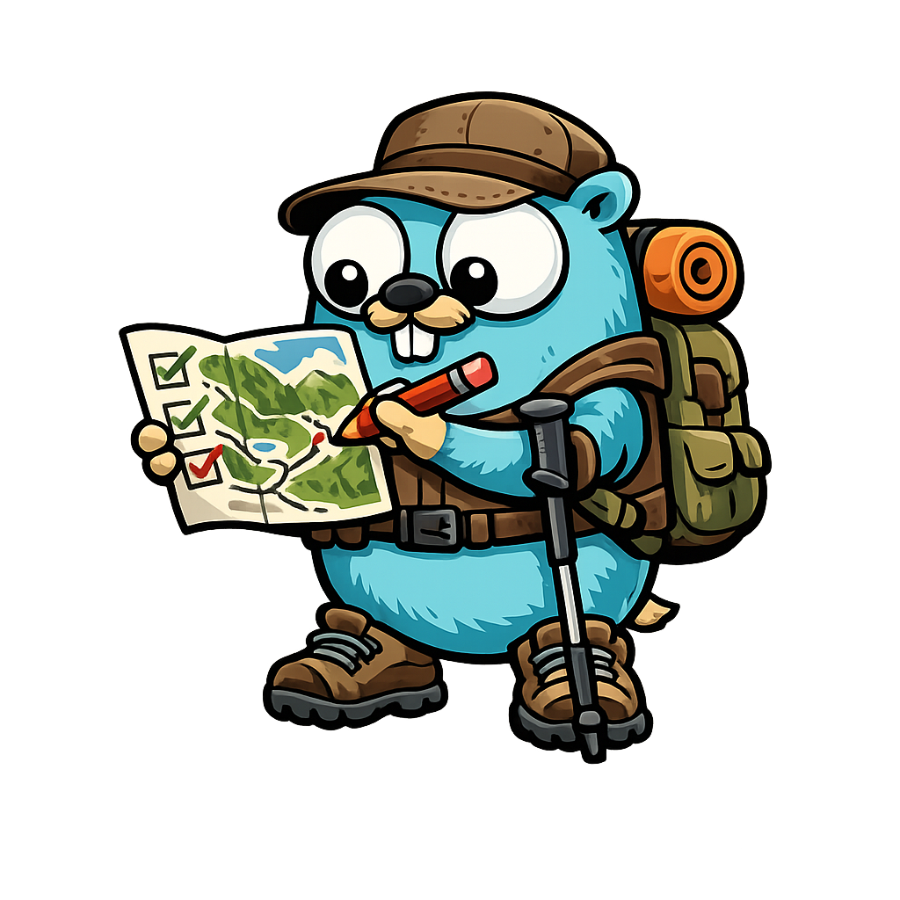

# trails-completionist

A simple Golang application to parse a list of trails, then display that in a searchable HTML table for ease of tracking completion of trails. Optionally convert a directory of TCX trail files to GPX for ease of parsing.

## 🚀 Features
- Responsive design with automatic light/dark mode
- Fuzzy search across all columns
- Advanced filtering with specific column searches
- Easy-to-use interface

## 🔍 Search Examples
- `completed: yes` - Show only completed trails
- `park name: Forest Park` - Trails in Forest Park
- `Moderate yes` - Moderate trails that are completed
- `5 miles` - Trails with "5" in their length

## 🛠️ Technology Stack
- Go
- HTML5
- CSS3 (with CSS Variables for theming)
- Vanilla JavaScript

## 🌐 Webpage Usage
- Type in the search bar to filter trails
- Use specific column searches like "completed: yes"
- Combine multiple search criteria

## 🧑‍💻 Development
Operations on the trails-completionist application are driven by Task. See `task --list` for more details.

## 🏗️ Sub-commands
The application provides several sub-commands for different operations:
- `convert` - Convert TCX files to GPX format
- `full` - Run the full trails-completionist pipeline.
- `generate-checklist` - Generate trails checklist from raw input and GPX files.
- `generate-html` - Generate HTML page from template and trails checklist file.
- `osm-export` - Load OSM XML and export parsed map to binary file.
- `parse-gpx` - Parse trails out of GPX files.
- `serve` - Run web server to display generated HTML page and interact with the trails table.
- `version` - Show the current version of the application.

Run `./trails-completionist --help` to see all available sub-commands and their options.

## 🔄 Changes required to update golang version
`task go:update-version`
